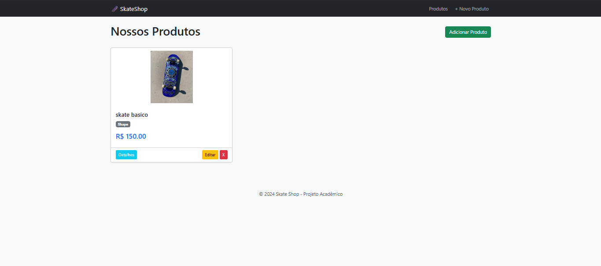
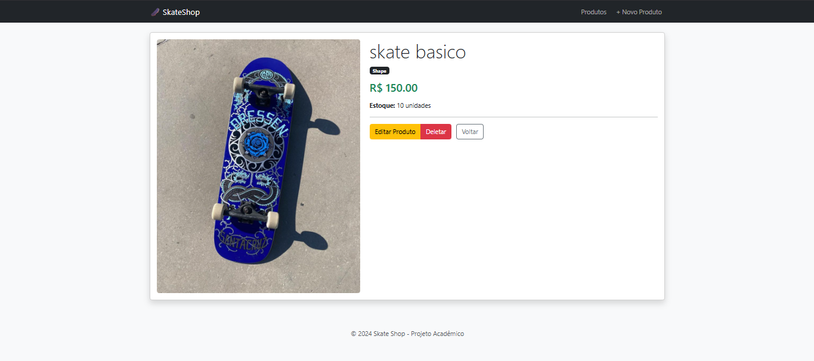
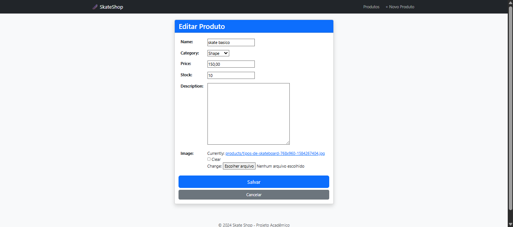
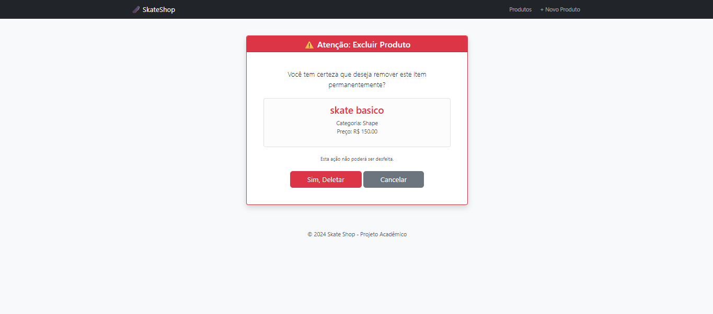

#  Skate Shop Manager (Django Edition)


Uma aplicação web completa de gerenciamento de produtos (CRUD) para uma loja de Skate, desenvolvida em **Python** com **Django**.

> 💡 **Nota do Desenvolvedor:** Este projeto é uma refatoração/releitura de um trabalho acadêmico originalmente desenvolvido em *Ruby on Rails* no meu 1º ano de faculdade. O objetivo foi aplicar conhecimentos de Orientação a Objetos em uma nova stack tecnológica.

---

##  Screenshots

|                  Lista de Produtos                 |                    Detalhes do Produto                   |
| :------------------------------------------------: | :------------------------------------------------------: |
|  |  |

|                Formulário de Edição                |                 Confirmação de Exclusão                |
| :------------------------------------------------: | :----------------------------------------------------: |
|  |  |


---

##  Tecnologias Utilizadas

O projeto foi construído focando na arquitetura **MVT (Model-View-Template)** do Django.

* **Backend:** Python 3.11 + Django 5.0
* **Banco de Dados:** SQLite (padrão do Django, ideal para desenvolvimento)
* **Frontend:** HTML5, CSS3 e **Bootstrap 5** (para responsividade e componentes visuais)
* **Gerenciamento de Mídia:** Biblioteca `Pillow` para upload e renderização de imagens.

---

##  Funcionalidades

O sistema implementa o ciclo completo de um CRUD com proteções de integridade:

1. **Create (Criação):** Cadastro de novos produtos (Shapes, Trucks, Rodas) com upload de foto e associação obrigatória de categoria.
2. **Read (Leitura):**

   * Listagem visual com Cards.
   * Página de detalhes individuais do produto.
3. **Update (Atualização):** Formulário pré-preenchido para editar informações ou alterar a imagem do produto.
4. **Delete (Exclusão):** Sistema seguro com **página de confirmação** (impede cliques acidentais), exibindo o resumo do item a ser deletado.

---

##  Como rodar o projeto localmente

Pré-requisitos: Você precisa ter o [Python](https://www.python.org/) instalado.

### 1. Clone o repositório

```bash
git clone https://github.com/SEU-USUARIO/skateshop-django.git
cd skateshop-django
```

### 2. Crie o Ambiente Virtual

```bash
# No Windows
py -m venv venv
.\venv\Scripts\Activate

# No Linux/Mac
python3 -m venv venv
source venv/bin/activate
```

### 3. Instale as dependências

```bash
pip install -r requirements.txt
```

### 4. Prepare o Banco de Dados

```bash
python manage.py migrate
```

### 5. Crie um Superusuário (Importante!)

Para acessar o painel admin e cadastrar as Categorias (obrigatório antes de criar produtos):

```bash
python manage.py createsuperuser
```

### 6. Rode o Servidor

```bash
python manage.py runserver
```

Acesse no seu navegador: [http://127.0.0.1:8000/](http://127.0.0.1:8000/)

---

##  Aprendizados e Evolução

Este projeto marcou a transição do paradigma do Rails (ActiveRecord, Scaffolds) para o Django (ORM, Class Based Views).

**Principais desafios superados:**

* Configuração de arquivos estáticos e de mídia (`MEDIA_URL`).
* Uso de Template Inheritance (``) para evitar repetição de código HTML.
* Implementação de lógica de segurança na exclusão de dados.

---

##  Autor

Feito com 💙 e muito café. **Júlio Cesar** – [GitHub](https://github.com/Julio1099)
